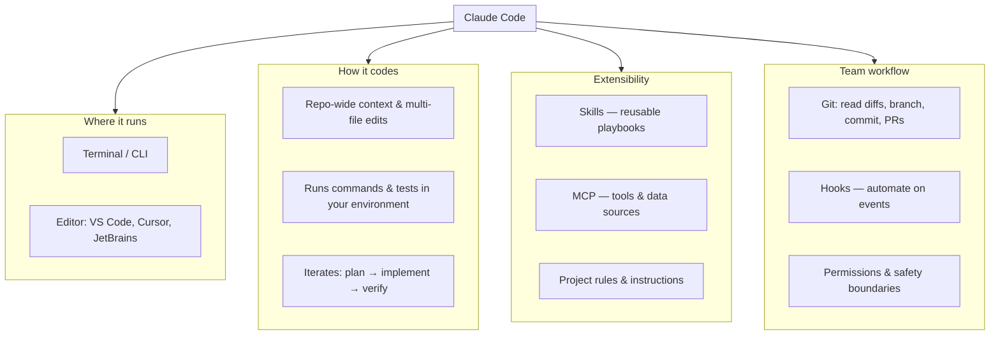

# Calculator

A simple, single-page calculator built with HTML, CSS, and JavaScript.

## How to Use

Open `calculator.html` in any modern web browser. No build tools or dependencies required.

## Features

- **Basic math**: addition, subtraction, multiplication, division, and modulo
- **AC**: clears all input and resets the display
- **DEL**: removes the last entered character
- **Decimal support**: prevents duplicate dots in a single number
- **Chained operations**: continue calculating from the previous result
- **Negate (±)**: toggles the current number between positive and negative
- **Square (x²)**: squares the current value or evaluated expression
- **Keyboard input**: use your keyboard as an alternative to clicking buttons

## Keyboard Shortcuts

| Key | Action |
|-----|--------|
| `0-9` | Enter digits |
| `.` | Decimal point |
| `+` `-` `*` `/` `%` | Operators |
| `Enter` | Calculate result |
| `Backspace` | Delete last character |
| `Escape` | Clear all |
| `F9` | Negate (±) |
| `F2` | Square (x²) |
